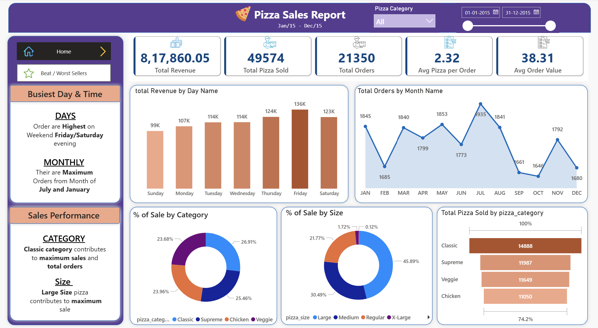
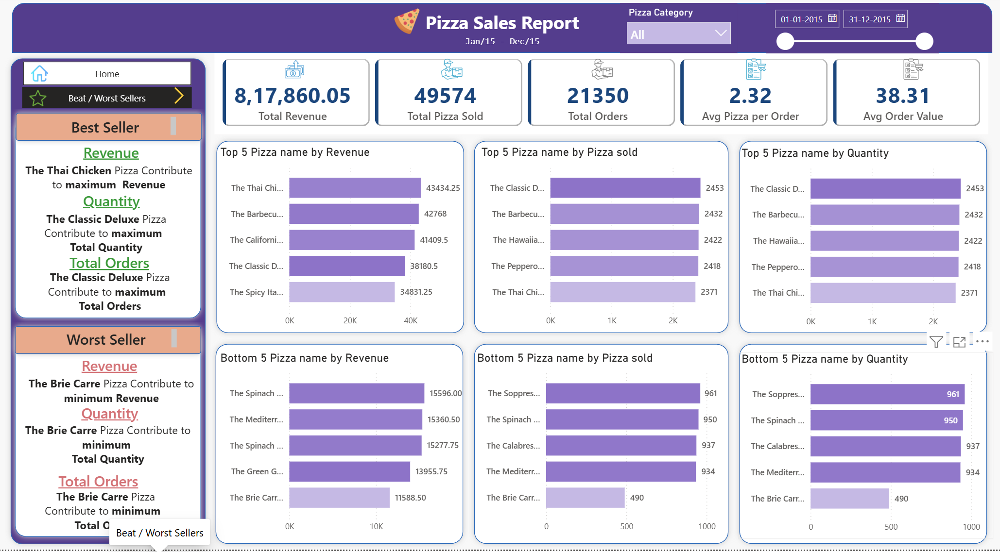

write my README

# 🍕 Pizza Sales Analysis | SQL Server + Power BI

End-to-end sales analysis project using SQL Server for data ingestion & querying and Power BI for interactive dashboard and KPI visualization.

---

## 📌 Problem Statement

A pizza restaurant chain wants to analyze its sales data to understand:
- Which pizzas are best and worst performing?
- What are the busiest days and times?
- Which category and size drives maximum revenue?

---

## 🛠️ Tools Used

- **SQL Server** — Database creation, bulk data loading, KPI validation
- **Power BI** — Dashboard design, DAX measures, data visualization
- **DAX** — Calculated KPIs and dynamic measures

---

## 📊 Dashboard Overview

Two interactive pages:

**Home Page**
- Total Revenue, Total Orders, Total Pizzas Sold, Avg Order Value, Avg Pizzas per Order
- Revenue by Day and Month trends
- Sales by Category and Size

**Best / Worst Sellers Page**
- Top 5 and Bottom 5 pizzas by Revenue, Quantity and Orders

---

## 🔍 Key Insights

- 💰 Total Revenue: ₹8,17,860 from 21,350 orders
- 🏆 Best seller by Revenue: **Thai Chicken Pizza**
- 🏆 Best seller by Quantity: **Classic Deluxe Pizza**
- 📉 Worst seller: **Brie Carre Pizza**
- 📅 Peak days: **Friday & Saturday evenings**
- 📅 Peak months: **July and January**
- 🍕 Large size pizzas = **45.89%** of total sales
- 🍕 Classic category = highest orders and revenue

---

## ⚙️ SQL Highlights

- Created staging table for BULK INSERT with VARCHAR columns
- Used `TRY_CONVERT` to handle date/time format mismatches
- Wrote queries to verify all KPIs before building visuals
- Renamed columns using `sp_rename`

---

## 📸 Dashboard Screenshots

---

## 📁 Files in this Repository

| File | Description |
|------|-------------|
| `Pizzasales.pbix` | Power BI dashboard file |
| `SQL_project_1.sql` | All SQL queries used |
| `pizza_sales.csv` | Dataset used for analysis |
| `Screenshot *.png` | Dashboard screenshots |

---

## 🚀 How to Use

1. Open `SQL_project_1.sql` in SQL Server Management Studio
2. Run queries to create and load the database
3. Open `Pizzasales.pbix` in Power BI Desktop
4. Refresh the data connection if needed

---

## 📜 License

This project is licensed under the MIT License.
